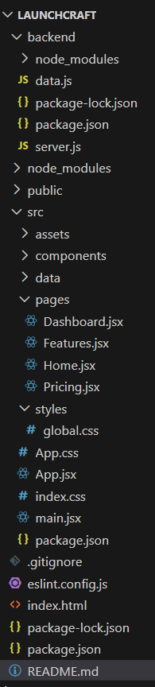

# LaunchCraft

LaunchCraft is a SaaS-style web application prototype built to demonstrate frontend architecture, UI design, routing, dashboard visualization, and basic frontend–backend integration. The project is intentionally scoped to focus on clarity, structure, and extensibility rather than full production complexity.

## Project Overview

LaunchCraft represents a SaaS product builder interface where users can explore product information and view analytics through a dashboard. The application is designed as a frontend-first SaaS prototype with a lightweight backend layer to serve data via APIs.

This approach allows clear demonstration of frontend skills while keeping the backend simple and easy to extend in the future.

## Technology Stack

### Frontend

* React
* Vite
* React Router DOM
* Recharts
* Custom CSS (light SaaS theme)

### Backend (Level 2 – Simple Backend)

* Node.js
* Express.js
* CORS
* REST APIs with JSON responses

## Project Structure

## Features Implemented

### Frontend

* Multi-page SaaS layout (Home, Features, Pricing, Dashboard)
* Client-side routing using React Router
* Reusable UI components
* Clean and responsive light theme
* Dashboard cards displaying key metrics
* Line chart for weekly user activity
* Navigation-enabled call-to-action buttons

### Backend

* Express server running locally
* REST API endpoints serving dashboard data
* Frontend consumes real data from backend APIs
* No database or authentication (intentional scope decision)

## API Endpoints

| Endpoint        | Description                                                                 |
| --------------- | --------------------------------------------------------------------------- |
| `/api/metrics`  | Returns dashboard metrics such as users, revenue, projects, and deployments |
| `/api/usage`    | Returns weekly user activity data                                           |
| `/api/activity` | Returns recent activity logs                                                |

## How to Run the Project

### Step 1: Clone the Repository

git clone https://github.com/Mahek-Lodaliya/launchcraft.git

### Step 2: Run Backend

cd backend
npm install
npm start

Backend runs on:
http://localhost:5000

### Step 3: Run Frontend

Open a new terminal window:

npm install
npm run dev

Frontend runs on:

http://localhost:5173
